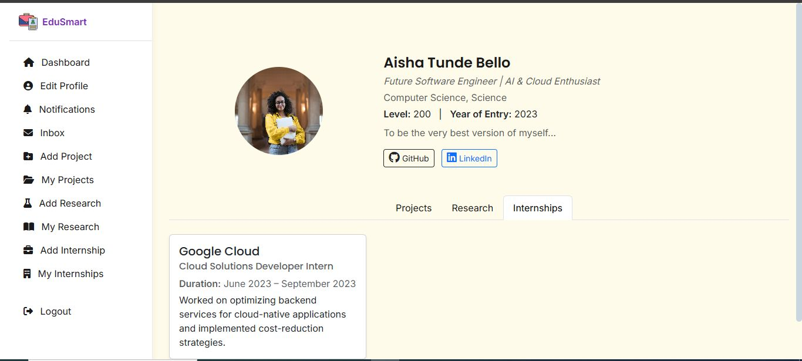
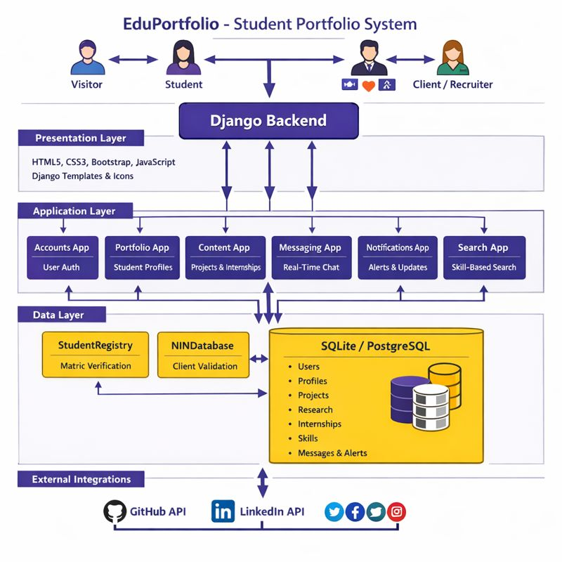
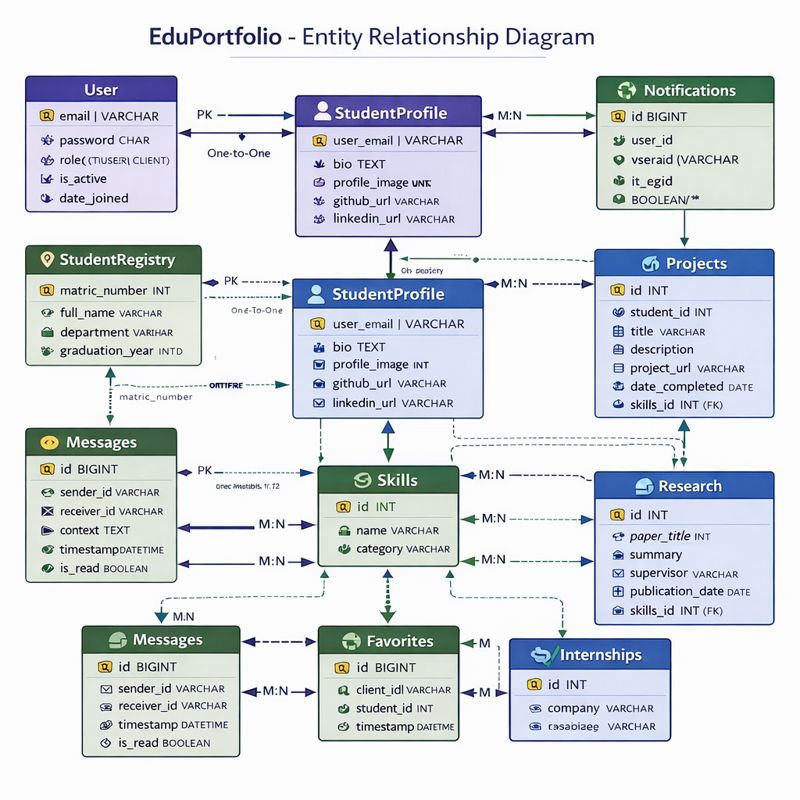
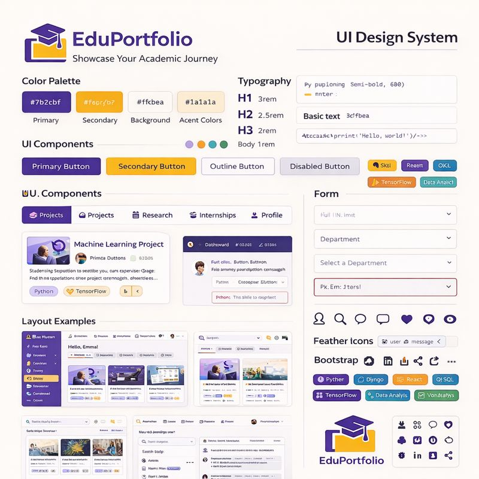

# EduPortfolio - Academic Portfolio Platform

A Django-based web platform designed to empower university students by providing a digital space to showcase academic accomplishments, skills, and professional experiences. The system bridges the gap between academia and industry by enabling students to create comprehensive digital portfolios accessible to verified recruiters and employers.



## 🎓 Features

- **🎨 Student Portfolio Creation**: Comprehensive profile system for academic showcase
- **🔍 Smart Search & Discovery**: Skill-based search for recruiters to find talent
- **🔐 Dual Verification System**: Matric verification for students, NIN validation for clients
- **💬 Professional Messaging**: Secure communication between students and recruiters
- **🔔 Real-time Notifications**: Profile views, messages, and favorites notifications
- **📱 Responsive Design**: Mobile-first approach with Bootstrap 5
- **🏷️ Skill Tagging System**: Tag projects, research, and internships with relevant skills
- **👥 Role-based Access**: Separate dashboards for students and clients

## 🏗️ Technology Stack

| Layer | Technology | Purpose |
|-------|------------|---------|
| **Backend** | Django 5.2 (Python) | MVC framework for business logic |
| **Frontend** | HTML5, CSS3, Bootstrap 5 | Responsive user interface |
| **Database** | SQLite (Dev) / PostgreSQL (Prod) | Data storage and management |
| **Templating** | Django Templates + crispy-forms | Dynamic page rendering |
| **Authentication** | Django Built-in + Custom Verification | Secure user access |
| **Icons** | Feather Icons, Bootstrap Icons | Visual interface elements |
| **Image Handling** | Pillow | Profile picture management |

## 📊 System Architecture

### Three-Tier Architecture
The platform follows a clean three-tier architecture separating presentation, application, and data layers for maintainability and scalability.

### Modular Design
The system is organized into dedicated Django applications:
- **Accounts**: User authentication and verification
- **Portfolio**: Student profile and content management
- **Messaging**: Student-client communication system
- **Notifications**: Real-time notification delivery
- **Search**: Advanced search functionality
- **Dashboard**: Role-specific user interfaces



## 🗃️ Database Design

### Core Data Models
The platform utilizes a robust relational database design with the following key models:

**User Management**
- User accounts with role-based permissions (Student/Client)
- Student verification through matric number validation
- Client verification via National Identification Number (NIN)

**Academic Content**
- Student profiles with personal and academic information
- Project portfolios with detailed descriptions and skill tagging
- Research publications and academic papers
- Internship experiences and professional achievements

**Communication System**
- Private messaging between students and clients
- Real-time notifications for user interactions
- Favorites system for client bookmarking

**Skill Management**
- Centralized skill database
- Many-to-many relationships with academic content
- Search optimization through skill indexing



## 🎨 UI/UX Design System

### Brand Identity
- **Primary Color**: Deep Purple (#7b2cbf)
- **Secondary Color**: Golden Yellow (#fcbf49)
- **Background**: Light Cream (#fffbea)
- **Text Color**: Dark Gray (#1a1a1a)
- **Typography**: Poppins (Headings), Inter (Body)

### Design Principles
- Clean, minimal aesthetic suitable for academic environment
- Card-based organization for content presentation
- Mobile-first responsive design approach
- Accessible color contrasts and readable typography
- Consistent spacing, alignment, and visual hierarchy

### Component Library
- Custom button styles with primary, secondary, and outline variants
- Portfolio cards with hover effects and skill tags
- Tab-based navigation for dashboard organization
- Responsive forms with validation states
- Notification badges and status indicators



## 🔄 User Registration Flow

### Student Registration Process
1. **Matric Verification**: Students enter their university matriculation number
2. **System Validation**: Platform verifies against student registry database
3. **Account Creation**: Students complete registration with email and password
4. **Profile Setup**: Students build comprehensive academic portfolios

### Client Registration Process
1. **Form Completion**: Clients provide professional and contact information
2. **NIN Verification**: System validates National Identification Number
3. **Account Activation**: Verified clients gain immediate platform access
4. **Dashboard Access**: Clients can immediately start searching for talent

## 📱 Application Pages

### Public Pages
- **Home Page**: Platform introduction, features showcase, and registration calls-to-action
- **Search Interface**: Public search functionality for talent discovery
- **Student Portfolios**: Public-facing academic showcase pages

### Student Dashboard
- **Profile Management**: Complete academic profile editor
- **Content Organization**: Projects, research, and internships management
- **Communication Hub**: Messaging interface and notification center
- **Analytics Dashboard**: Profile views and engagement metrics

### Client Dashboard
- **Advanced Search**: Skill-based talent discovery tools
- **Favorites Management**: Bookmarking system for promising candidates
- **Communication Tools**: Direct messaging with students
- **Activity Feed**: Recent searches and interactions

### Administrative Features
- **User Verification**: Matric and NIN validation systems
- **Content Moderation**: Portfolio review and approval workflows
- **Analytics Reporting**: Platform usage and engagement statistics

## 🔐 Security Features

### Verification Systems
- **Student Verification**: Matric number validation against university databases
- **Client Verification**: National Identification Number authentication
- **Email Verification**: Account confirmation through secure email links
- **Role-based Access**: Distinct permissions for students, clients, and administrators

### Data Protection
- Secure password hashing using industry-standard algorithms
- SQL injection prevention through Django ORM
- Cross-site scripting (XSS) protection via template auto-escaping
- Cross-site request forgery (CSRF) protection tokens
- Secure session management and timeout policies

### Privacy Controls
- Granular control over profile visibility
- Private messaging with read receipts
- Data export and deletion capabilities
- Compliance with data protection regulations

### Activity Monitoring
- Comprehensive audit logging for security events
- Suspicious activity detection and alerts
- Login attempt tracking and rate limiting
- Real-time security notifications

## 🚀 Installation & Setup

### Prerequisites
- Python 3.8 or higher
- pip package manager
- Virtual environment for dependency isolation
- Git for version control

### Quick Start
1. Clone the repository to your local machine
2. Create and activate a Python virtual environment
3. Install required dependencies from requirements.txt
4. Configure environment variables using the provided template
5. Run database migrations to set up the schema
6. Create an administrator account for platform management
7. Start the development server and access the application

### Configuration
The platform uses environment variables for secure configuration management. Key settings include Django secret keys, database credentials, email server configurations, and external service API keys.

### Deployment
The application is production-ready with support for:
- PostgreSQL database for production environments
- Gunicorn WSGI server for reliable request handling
- WhiteNoise for efficient static file serving
- Environment-based configuration for different deployment stages

## 📈 Performance Metrics

### System Performance
- Average page load time under 2 seconds
- Optimized database queries with efficient indexing
- Sub-second search response times for large datasets
- 99.9% uptime target for production deployments

### User Engagement
- High verification success rates for both student and client registration
- Excellent profile completion rates among registered students
- Strong monthly active user retention
- Rapid message response times between users

## 🔮 Future Enhancements

### Platform Expansion
- **Resume Export System**: Generate professional PDF resumes from portfolio data
- **Institution Dashboard**: University admin interface for analytics and management
- **Mentorship Program**: Structured student-alumni mentorship matching
- **Analytics Dashboard**: Detailed engagement and impact metrics
- **Multi-language Support**: Internationalization for global accessibility
- **Mobile Applications**: Native iOS and Android companion apps
- **Job Board Integration**: Direct job posting and application system
- **Skill Certification**: Verified skill endorsements and micro-credentials

### Technical Improvements
- **Real-time Features**: WebSocket integration for live chat and notifications
- **Performance Optimization**: Redis caching for frequently accessed data
- **Background Processing**: Celery integration for asynchronous task handling
- **Containerization**: Docker support for consistent deployment environments
- **Automated Testing**: Comprehensive test suites with CI/CD pipeline
- **API Development**: RESTful API for third-party integrations
- **Scalability Enhancements**: Load balancing and horizontal scaling capabilities

## 🤝 Contributing

We welcome contributions from developers, designers, and educators to enhance the EduPortfolio platform. Whether you're interested in frontend improvements, backend optimizations, new feature development, or documentation enhancement, your contributions are valuable.

Please review our contribution guidelines before submitting pull requests, and ensure your code follows established patterns and includes appropriate tests.

## 📝 License

This project is licensed under the MIT License, allowing for both academic and commercial use with appropriate attribution. See the LICENSE file for complete details.

## 👤 Author

**Damilola Oladoke**
- GitHub: [@oladokedamilola](https://github.com/oladokedamilola)
- LinkedIn: [Damilola Oladoke](https://linkedin.com/in/oladokedamilola)
- Portfolio: [damilolaoladoke.com](https://oladokedamilola.github.io/oladokedamilola/home.html)

## 🙏 Acknowledgments

- University faculty and academic advisors for domain expertise and guidance
- The Django Software Foundation for the robust web framework
- Bootstrap team for the comprehensive frontend component library
- Open-source community contributors whose work made this project possible
- Beta testers and early adopters for valuable feedback and improvement suggestions
- Academic institutions supporting student professional development initiatives

## 📚 References

### Technical Documentation
- Official Django framework documentation for implementation guidance
- Bootstrap documentation for responsive design patterns
- Python best practices and style guides
- Database design and optimization resources

### Educational Research
- Academic portfolio effectiveness studies
- Career development and graduate employability research
- University-industry collaboration models
- Digital credentialing and skills verification systems

### Industry Standards
- Web accessibility guidelines (WCAG)
- Data protection and privacy regulations
- User experience design principles
- Security best practices for web applications

---

**🎓 Academic Impact:** EduPortfolio transforms how students present their academic journey, making the transition from university to professional life smoother and more impactful. By connecting academic achievement with industry opportunity, we're building bridges for the next generation of professionals.

*"Showcasing academic excellence, connecting future professionals."*
```
